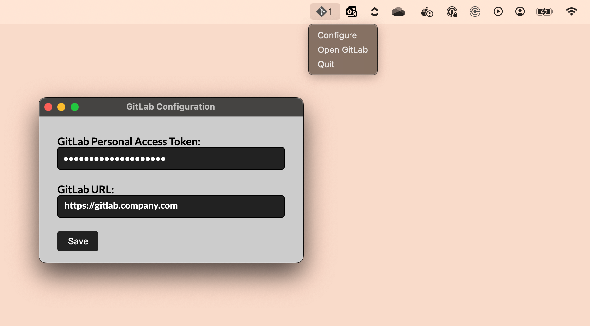

### TodoGit 
The macOS tray icon with number of active tasks (MRs) waiting for you on GitLab

### Download: [TodoGit-1.0.0.dmg](https://github.com/arajnoha/todogit/releases/download/v1.0.0/TodoGit-1.0.0.dmg)

- Generate an access token at your gitlab instance
- paste it with the URL of your gitlab
- TodoGit will check your TODOs or assigned MRs every minute
- Quickly open the gitlab GUI from the dropdown menu

Credentials are stored in json within this application bundle and hence, unaccessable from the outside. The app itself doesn't perform any http requests other than to your specified server.
